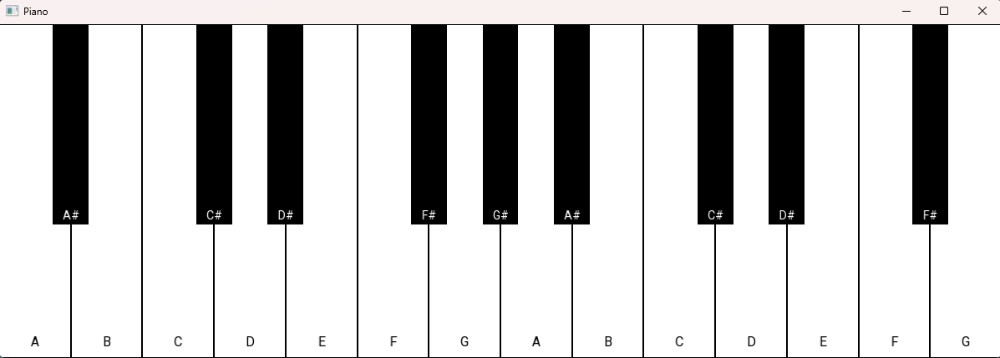

# SFML Piano

A simple piano application built with **C++ and SFML-3**.
Press keys on your keyboard to play piano notes.

- **White keys:** Tab, Q, W, E, R, T, Y, U, I, O, P, [, ], \
- **Black keys:** 1, 3, 4, 6, 7, 8, 0, -, Backspace

## Screenshot

## Requirements
- C++17 or later
- [SFML 3.0.0](https://www.sfml-dev.org/download/)

## Credits
I followed this tutorial by [Hopzbie](https://youtu.be/xvg0boRSvng?si=v8NmbyOnbUzRS67F) to make this project.
